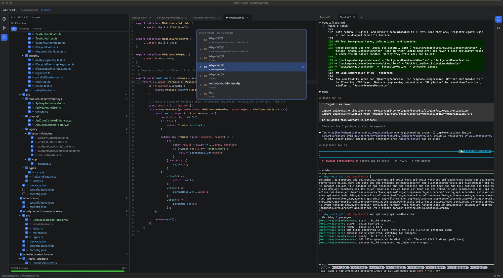

# tide

**My ideal WebStorm — a fast, native code editor / IDE, built in Rust.**

`t`**`IDE`** is a personal, opinionated code editor. It's the editor I wished WebStorm
was: instant to start, light on memory, native-fast, and built around *my*
day-to-day workflow (a large TypeScript monorepo + lots of git/PR work) instead
of trying to be everything for everyone.

> Not affiliated with JetBrains. The name is a wink at WebStorm — and at the
> `IDE` hiding inside "t-IDE".



---

## Why it exists

WebStorm is great but heavy. I wanted something that:

- **Starts instantly and stays snappy**, even with several projects open.
- **Stays out of the way** — minimal chrome, keyboard-first, no settings maze.
- **Is built exactly for my loop**: edit TS/JS, run things in a terminal, stage
  and commit, review PRs, jump around a big repo — without leaving the window.
- **Is mine to bend** — every behavior is a few lines of Rust away.

So it's a single native app that does the 20% of IDE features I use 100% of the
time, and does them fast.

## What it does

- **Editor** — syntax highlighting, LSP (completion, go-to-definition, hover,
  diagnostics), multi-tab, in-file search, undo/redo, line ops, drag-select,
  whole-line copy, ⌘-click to follow ESM import paths (`.js` → `.ts`).
- **File tree** — lazy directory tree with type-to-filter (nvim-style), git
  status colors, copy/paste/delete, reveal-active-file.
- **Fuzzy finder** — jump to any file (⌘⇧O) or any symbol/line.
- **Command palette** (⌘⇧P) for everything else.
- **Integrated terminal** — real PTY (works with zellij, vim, Claude Code…),
  text selection, scrollback + scrollbar, Nerd Font glyphs.
- **Git** — live status, a commit pane (stage/commit/push), branch switching,
  "create PR", and a current-branch PR link in the title bar.
- **PR review** — load a PR's changed files, mark viewed, open per-file diffs.
- **Find in files** — ripgrep-backed project search with live preview.
- **Diff viewer** — side-by-side working-tree / PR diffs.
- **Multi-project workspace** — keep several repos open and switch between them.

## Tech stack

| Area | Crate / tool |
|------|--------------|
| UI framework | [GPUI](https://github.com/zed-industries/zed) (Zed's GPU-accelerated UI), `gpui_platform` with `font-kit` |
| Language | Rust (edition 2021) |
| Terminal emulation | `alacritty_terminal` + `portable-pty` |
| Syntax highlighting | `syntect` + `two-face` |
| Diffing | `similar` |
| Project search | `ripgrep` (`rg`, external) |
| Git / PRs | `git` and the GitHub `gh` CLI (external) |
| JSON | `serde_json` |

GPUI is pulled straight from the Zed repo, with two patched forks
(`async-process`, `async-task`) pinned in `Cargo.toml` so `gpui_macos` builds.

## Requirements

- **macOS** (GPUI + the platform layer here target macOS).
- A recent **Rust** toolchain.
- **`gh`** (GitHub CLI), authenticated — for the PR features.
- **`rg`** (ripgrep) — for find-in-files.
- **`typescript-language-server`** on your `PATH` for LSP features (optional —
  the editor runs fine without it). Point at a specific binary with the
  `TIDE_TS_LSP` env var if it's not on `PATH`.
- A **Nerd Font** for terminal powerline/icon glyphs. The terminal expects
  `JetBrainsMono Nerd Font`:
  ```sh
  brew install --cask font-jetbrains-mono-nerd-font
  ```

## Build & run

```sh
# dev (deps are compiled at opt-level 3 so it's already smooth)
cargo run -- /path/to/project [more/projects ...]

# release build
cargo build --release
./target/release/tide /path/to/project
```

You can pass one or more project directories; they open as switchable
workspaces.

## Status

Personal project / work in progress. Expect rough edges, hardcoded bits, and
opinions baked in. Issues and PRs welcome but it's primarily built for me.
See [`DEV_NOTES.md`](./DEV_NOTES.md) for architecture and the non-obvious
decisions behind it.

## License

[MIT](./LICENSE) © Adrian Smijulj
